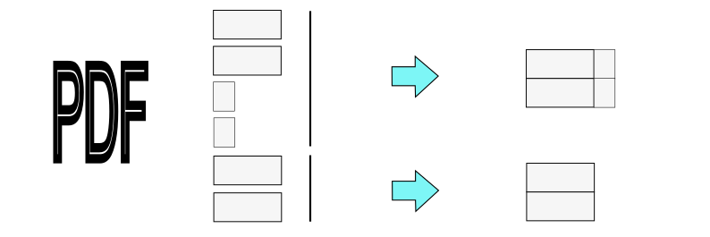

# mergePdfPages
Объединяет отдельные страницы исходного PDF файла в одну большего формата установленной высоты по несколько штук.
Делалось для сборки выведенных из Autocad чертежей по одному листу на страницу в полосу заданной ширины для печати на плоттере. 

Combines individual pages of the original PDF file into a single, larger format of a specified height, using multiple pages. 
This was done to assemble drawings output from AutoCAD, one sheet per page, into a strip of a specified width for plotting.
